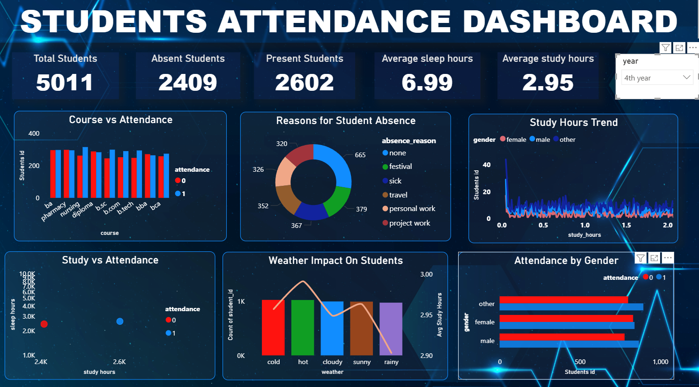
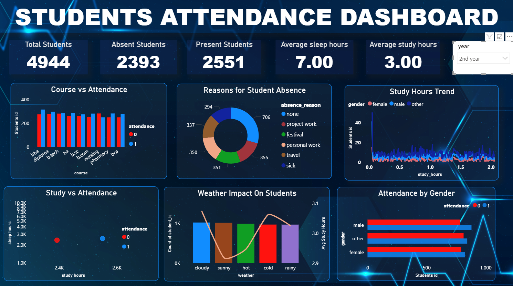
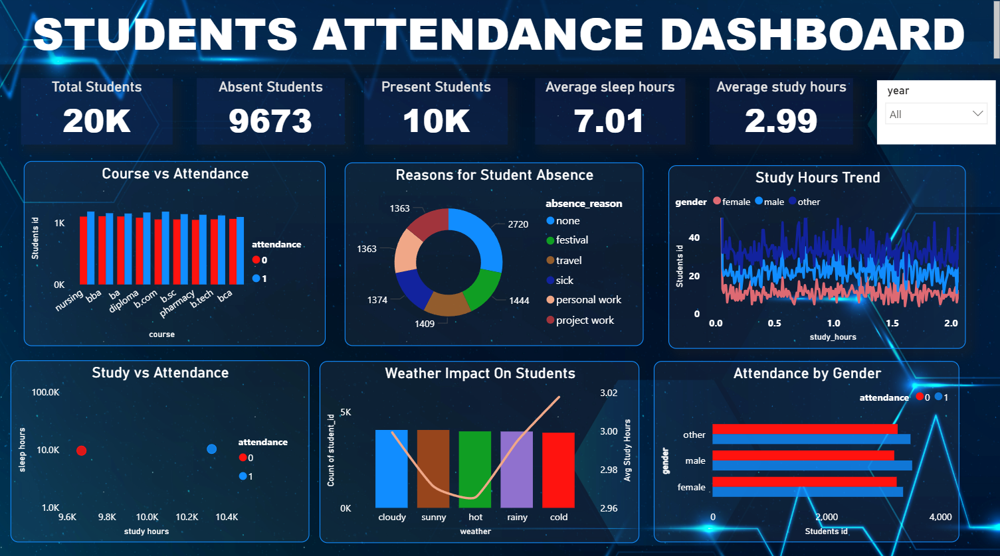

# 🎓 Student Attendance & Behaviour Analysis Dashboard

An interactive Power BI and Excel dashboard project analyzing attendance metrics, academic performance indicators, and behavioral trends across 500+ student records to support data-driven decision-making for educators and administrators.

---

## 📹 Video Walkthrough & Screenshots

### 🎥 Dashboard Demo
https://github.com/lekshmi001/Student-Attendance-Behaviour-Analysis-Dashboard/raw/main/dashboard.mp4

### 📸 Dashboard Screenshots
| Dashboard Image 1 | Dashboard Image 2 | Dashboard Image 3 |
| :---: | :---: | :---: |
|  |  |  |

---

## 🎯 Project Overview

This project transforms raw academic and attendance logs into actionable visual insights. By evaluating key operational metrics, the dashboard helps identify at-risk students, track attendance fluctuations over time, and evaluate the correlation between attendance patterns and overall student performance.

---

## 🔑 Key Features & Insights

* **Data Handling:** Processed and analyzed 500+ student records containing attendance logs, behavioral entries, and academic scores using [`Attendance_Prediction.csv`](./Attendance_Prediction.csv).
* **KPI Metrics:** Executive summaries tracking overall attendance rate, absenteeism trends, performance averages, and behavioral flags.
* **Trend & Pattern Analysis:** Identified recurring absenteeism patterns across specific dates, subjects, or student groups.
* **Drill-Down Capabilities:** Interactive views allowing users to zoom in from high-level institutional summaries down to individual student profiles.

---

## 🛠️ Tools & Technologies Used

* **Power BI:** Dynamic Dashboard Creation, DAX measures, KPI Cards, Drill-down Reports, and Interactive Slicers.
* **Microsoft Excel / CSV:** Data Cleaning, Structuring, Validation, and Exploratory Data Analysis (EDA).
* **Data Visualization:** Line Charts for Trend Analysis, Matrix Views, Bar Charts, and Conditional Formatting for behavioral risk flags.

---

## 📁 Repository Files

* **`dashboard.mp4`** — Video demonstration of the dynamic Power BI dashboard.
* **`Attendance_Prediction.csv`** — Dataset containing student performance, attendance records, and prediction variables.
* **`1.png`**, **`2.png`**, **`3.png`** — Dashboard images showcasing core visual reports and analysis tabs.
